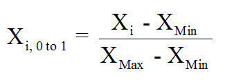
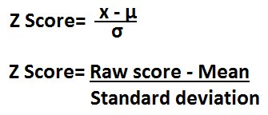
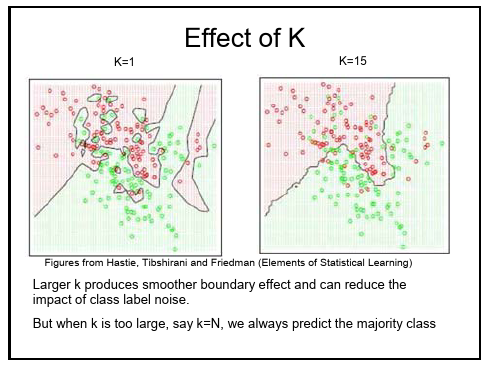

## Find it online!

https://github.com/jakecatlett/knn_biometrics

jfcatlett74@gmail.com

# Overview of the Model and the Case Presented

## What is kNN?

kNN is a relatively simple machine learning algorithm that is used for classification tasks.

It is often referred to as a "lazy learner" because it does not produce a true mathematical model.  (i.e. it doesn't fit the traditional definition of 'learning')

## How does it work?

  - Take a dataset for which the correct classifications of all observations are known  
  - Plot all of the observations as points on a graph  
  
  - Plot an observation for which the correct classification is not known
  
  - Calculate the distance between it and all the other observations on the graph
  
  - Determine the *k* nearest observations to that point
  
  - Whatever class the majority of those observations belong to, assign that class to      the unknown observation

*** 
### k-Nearest Neighbors Illustration


In this diagram, *k* has been set as 5.  We can see that the 5 nearest 'neighbors' to **X** have been identified.  Of those 5 observations, 4 of them belong to the group w1, and therefore **X** is classified as a member of w1 as well.

## What is kNN used for?

kNN has been used in many different cases, including

- Predicting what products a person might like

- Identifying cells in tumors as cancerous or benign

- Optical character recognition and facial recognition

- Identifying patterns in DNA (disease prediction, protein identification)


## Strengths of kNN

- It's relatively easy to implement

- It's surprisingly effective

- Training phase is very fast

- Data does not have to follow a particular type of distribution

- The math involved is simple and easy to understand

## Weaknesses of kNN

- Choosing the correct *k* is very important, yet can be tricky

- A true model is not produced, and therefore interpretation of results can be very      difficult

- Missing features are not handled well

- Non-numeric data needs further processing, and can be problematic

- The algorithm needs to be run every time new classifications are made, which
  can be extremely computationally expensive

## Using biometric data to identify users of mobile technology

We will be attempting to identify inviduals based on their individual walking patterns.

Pierluigi Casale at the Computer Vision Center in Barcelona Spain Created the dataset.

The data was originally used in the research paper 'Personalization and User Verification in Wearable Systems Using Biometric Walking Patterns' originally published in Personal and Ubiquitous Computing in 2012.

## The dataset

The data is actually in 22 files which collectively contain nearly 150,000 observations, each file consisting of a set of observations from one invdividual.

The observations were taken with an accelerometer in an Android phone that was placed in the users' shirt pocket.

Each subject walked across a specific walking trail in the wilderness in Spain.

Each observation represents one step, and contains 4 variables - the time elapsed during the step, and acceleration in the x, y, and z directions of 3-dimensional space.

The datasets were downloaded from the [University of California Irvine Machine Learning Repository](https://archive.ics.uci.edu/ml/datasets/User+Identification+From+Walking+Activity)

## Possible uses for the model

Given a sample of observations of a set of individuals, a piece of mobile or wearable technology could identify which person in the dataset was carrying or using it.  This could be used to

- Identify whether the person carrying a mobile phone was its actual user

- Create an automated check-out system where users of specific tools or technology at   a company could be identified simply by walking away with, or using the technology

- Report back on how specific users were using mobile technology, and whether or not    they were using it as intended or within permitted usage rules
  
- Automate loading of preferences or capabilities set for a list of users


# Performing the Analysis in R

## Different stages in our analysis

1. Data Exploration / Data Preparation

2. Training the Model

3. Evaluating / Improving the Model

5. Exploring / Interpreting Results

## Data Exploration and Preparation

The first step in R will be to set our working directory, then load one of the datasets into an R data frame and take a look at the first few observations.
```{R}
setwd("~/Documents/KNN_Presentation")
walkData <- read.csv("1.csv", header = FALSE)

head(walkData)
```
 ***
 
A greater or lesser number of rows can be viewed with the `head()` function by setting the `n` parameter:

```{R}
head(walkData, n=10)
```

Note that we only see the four variables in the data - there is no column containing a classification

***

In this step a row is added which contains the classification for this dataset.  Since the participants in the study remain anonymous we will simply identify them by the integer name of the data file their data resides in.

```{R}
walkData$class <- as.factor(1)

head(walkData)
```

***

Next a `for` loop is used to open each of the remaining 21 datasets, load them into a temporary data frame, add a new column with the classification value as in the previous step, and then bind the rows in the new data frame to the existing `walkData` data frame.

```{R}
for (i in 2:22) {
  fileName <- paste(toString(i), ".csv", sep = "")
  tempFrame <- read.csv(fileName, header = FALSE)
  tempFrame$class <- as.factor(i)
  walkData <- rbind(walkData, tempFrame)
}
```

Then save the raw data frame as a `.csv` file
```{R}
write.csv(walkData, 'walk_data.csv', row.names = FALSE)
```

***

Once again we'll use the `head()` function to view our data, as well as the `tail()` and `str()` functions to see if our data frame is looking the way we expect it to.

```{R}
head(walkData, n=3)
tail(walkData, n=3)
```
***
```{R}
str(walkData)
```

We can see that our column names are mostly meaningless.  The `colnames()` function can be used to easily change the column names in an R data frame.

```{R}
colnames(walkData) <- c("step_time", "acc_x", "acc_y", "acc_z", "class")
```

***

Now the `summary()` function will be used to give display a statistical summary of the variables in the dataset.

```{R}
summary(walkData)
```

***

Let's look at what proportion of the observations is represented by each class in the dataset.

```{R}
class_proportions <- round(prop.table(table(walkData$class)) * 100, 
                           digits = 1)
class_proportions
```
```{R make_barplot, results = 'hide'}
barplot(class_proportions,
     col = "blue",
     border = "green",
     main = "Distribution by Classes",
     ylab = "Proportion",
     xlab = "Class")
```

***

The `barplot()` function on the previous slide results in this visualization.  The obvious disparity in the proportion of observations represented by each class could have a great impact on how *k* is chosen, and could impact model accuracy.

```{R ref.label = 'make_barplot', echo = FALSE}
```

***

We'll also build some boxplots to look at the distribution of data within the different variables in the datasets.

```{R make_boxplot, eval = FALSE}

par(mfcol = c(1, 4))
boxplot(walkData$step_time, main = "Step Time", 
        col = "lightblue", outcol = "red")
boxplot(walkData$acc_x, main = "x Acceleration", 
        col = "lightblue", outcol = "red")
boxplot(walkData$acc_y, main = "y Acceleration", 
        col = "lightblue", outcol = "red")
boxplot(walkData$acc_z, main = "z Acceleration", 
        col = "lightblue", outcol = "red")
```

***

The plots show that the data is not normally distributed. Fortunately, kNN deals very well with this issue where other models do not.

```{R ref.label = 'make_boxplot', echo = FALSE}
```

***

For kNN to work properly all the variables need to be transformed to the same scale.  First of all we'll write a function that scales all 4 independent variables so that their values fall between 0 and 1.

This is the formula that is used to ahieve this:



***

```{R}
normalize <- function(x) {
  return ((x - min(x)) / (max(x) - min(x)))
}

walkData_N <- as.data.frame(lapply(walkData[1:4], normalize))
summary(walkData_N)
```

***

The next step we will take is to transform the variables to z-scores.  Here's a quick review of z-scores...
<br><br>
  

```{R fig.width=7, fig.height=4, echo=FALSE}
library(png)
library(grid)
img <- readPNG('Standard_deviation_diagram.png')
 grid.raster(img)
```

***

... and the function that is used to convert variables to z-scores.

<br><br>



***

For z-scores, though, the `scale()` function provided in R will do the work for us.

```{R}
walkData_Z <- as.data.frame(scale(walkData[1:4]))
summary(walkData_Z)
```

***

Whenever machine learning models are produced it is essential to have at minimum a training set and a test set.  In practice 3 sets are often used, a training set, a test set, and a validation set; however, for our case we will just use two.

```{R eval=FALSE}
install.packages("caTools")
```
```{R}
library(caTools)
set.seed(1212)
training_split <- sample.split(walkData$class, SplitRatio = 9/10)
normal_train <- walkData_N[training_split, ]
normal_test <- walkData_N[!training_split, ]
Z_train <- walkData_Z[training_split, ]
Z_test <- walkData_Z[!training_split, ]
```

***

And remember, our datasets now contain *only the variables* and not the classifications themselves.  We will need to create two vectors that contain the correct classes for each of the observations in the training set and each of the observations in the test set.

```{R}
walkTrain_labels <- walkData$class[training_split]
walkTest_labels <- walkData$class[!training_split]
```

***

And now we'll look at the class proportions for the training and the test datasets.

```{R fig.width=5, fig.height=2.8, echo = FALSE}
barplot(round(prop.table(table(walkTrain_labels)) * 100, digits = 1),
     col = "blue",
     border = "green",
     main = "Class Distributions in Training Set",
     ylab = "Proportion",
     xlab = "Class")

barplot(round(prop.table(table(walkTest_labels)) * 100, digits = 1),
     col = "blue",
     border = "green",
     main = "Class Distributions in Test Set",
     ylab = "Proportion",
     xlab = "Class")
```

## Training the Model

Choosing a good value of *k* is an essential step in a kNN analysis.  Here's an illustration of how the choice of *k* can affect decision boundaries.



***

<br>

A good starting point is usually the square root of *n*, the number of observations in the dataset.  However, since there are so many classes and the distribution of the classes in the dataset is not equal, this turned out to be a horrible choice.

<br>

A large value for *k* would likely result in very poor performance of the model within the under-represented classes.  With this in mind, we'll look at the number of records in class *19* (the least common class) within both the training and test datasets, and determine the square roots of these two numbers.

***

```{R}
sum(walkTrain_labels == 19)
sum(walkTest_labels == 19)

round(sqrt(sum(walkTrain_labels == 19)))
round(sqrt(sum(walkTest_labels == 19)))
```

***

Now that a couple of values for *k* have been chosen, the algorithm can be run on the data to see how well it performs with those parameters.

First we will test two models using the data normalized between 0 and 1.  We'll do this with the `knn()` function provided in the `class` package.

``` {R}
library(class)

walkTest_N_pred_k10 <- knn(train = normal_train, 
                       test = normal_test,
                       cl = walkTrain_labels,
                       k = 10)

walkTest_N_pred_k30 <- knn(train = normal_train, 
                       test = normal_test,
                       cl = walkTrain_labels,
                       k = 30)
```

***

Then we will test two models using the data that has been transformed to z-scores

```{R}
walkTest_Z_pred_k10 <- knn(train = Z_train, 
                           test = Z_test,
                           cl = walkTrain_labels, 
                           k = 10)

walkTest_Z_pred_k30 <- knn(train = Z_train, 
                           test = Z_test,
                           cl = walkTrain_labels, 
                           k = 30)
```

***

Then for each each model we'll find the overall accuracy.

```{R}
matches <- which(walkTest_labels == walkTest_N_pred_k10)
round((length(matches) / length(walkTest_labels)) * 100, digits = 1)

matches <- which(walkTest_labels == walkTest_N_pred_k30)
round((length(matches) / length(walkTest_labels)) * 100, digits = 1)
```

***

```{R}
matches <- which(walkTest_labels == walkTest_Z_pred_k10)
round((length(matches) / length(walkTest_labels)) * 100, digits = 1)

matches <- which(walkTest_labels == walkTest_Z_pred_k30)
round((length(matches) / length(walkTest_labels)) * 100, digits = 1)
```

*** 

We determine that normalized data should be used, and that 10 to 30 are an interesting range to search within for a good value of *k*.  Check out my nifty method for testing different values of *k*!

```{R}
results <- data.frame(k = character(0), results = numeric(0))

for (i in 5:14) {
  num_k <- (i * 2 + 1)
  walkTest_pred <- knn(train = normal_train, test = normal_test,
                             cl = walkTrain_labels, k = num_k)
  
  walk_N_matches <- which(walkTest_labels == walkTest_pred)
  
  col1 <- paste("k =", toString(num_k), sep = " ")
  col2 <- round((length(walk_N_matches) / nrow(normal_test) * 100), 
                digits = 1)
  cols <- data.frame(k = col1, results = col2)
  
  results <- rbind(results, cols)
}
```

***

Now we can see the results for each value of *k* used in the model

```{R}
results
```

***

According to the results of our parameter tests, *k = 13* seems to be the "sweet spot".  We'll run the model one more time at that setting and use the predictions for our final steps.

```{R}
walkTest_N_pred_k13 <- knn(train = normal_train, 
                       test = normal_test,
                       cl = walkTrain_labels,
                       k = 13)
```

## Exploring / Interpreting results

### Creating a 'bucket voting' system to see if the system performs better when given a set of observations.

***

```{R}
create_bplot <- function(class, sample_size, class_data, predict_data){
    class_list <- unique(class_data)
    index <- which(class_data == class)
    sample <- index[sample(1:length(index), sample_size, replace = FALSE)]
    predictions <- predict_data[sample]
    this_class <- ifelse(class_list == class, "red", "blue")
    barplot(table(predictions),
                  col = this_class,
                  border = "green",
                  main = "Test for Classifcation Accuracy",
                  ylab = "Count",
                  xlab = "Class",
                  ylim = c(0, sample_size))
}
```

***

```{R}
create_bplot(15, 50, walkTest_labels, walkTest_N_pred_k13)
```

***

```{R}
create_bplot(16, 50, walkTest_labels, walkTest_N_pred_k13)
```

***

```{R}
create_bplot(17, 50, walkTest_labels, walkTest_N_pred_k13)
```

***

```{R}
create_bplot(18, 50, walkTest_labels, walkTest_N_pred_k13)
```

***

```{R}
create_bplot(19, 50, walkTest_labels, walkTest_N_pred_k13)
```

***

```{R}
create_bplot(1, 25, walkTest_labels, walkTest_N_pred_k13)
```

***

```{R}
create_bplot(3, 25, walkTest_labels, walkTest_N_pred_k13)
```

***

```{R}
create_bplot(5, 25, walkTest_labels, walkTest_N_pred_k13)
```

***

```{R}
create_bplot(7, 25, walkTest_labels, walkTest_N_pred_k13)
```

***

```{R}
create_bplot(9, 25, walkTest_labels, walkTest_N_pred_k13)
```